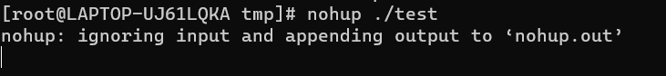

**nohup** 英文全称 no hang up（不挂起），用于在系统后台不挂断地运行命令，退出终端不会影响程序的运行,并在没有后台运行

**nohup** 命令，在默认情况下（非重定向时），会输出一个名叫 nohup.out 的文件到当前目录下，如果当前目录的 nohup.out 文件不可写，输出重定向到 **$HOME/nohup.out** 文件中。

nohup与&区别：

- nohup不会在后台运行，前台无法输入

  

- &是指在后台运行，当用户挂起（退出终端、断开ssh）时，命令会退出

**nohup COMMAND &** 命令，nohup与&结合可以让命令常驻与后台运行

**nohup command  ./test  1>out.txt  2>&1  & **

​	1>out.txt是将标准输出重定向到out.txt文件中，标准输出的内容会输出到out.txt文件中

​	2>&1 将标准出错重定向到标准输出，标准输出已经重定向到了out.file文件，即标准出错也会输出到out.file文件中

​	**nohup command  ./test  1>out.txt  2>&1  & **也可以是**nohup command  ./test >out.txt  2>&1  & ** ，重定向符号>默认是1

**/dev/null 2>&1**

​	输出默认重定向到标准输出即>1, 此命令等价于1>/dev/null 2>&1

​	/dev/null等价于一个只写文件,所有写入它的内容都会永远丢失,而尝试从它那儿读取内容什么也读不到。

​	所以此命令的含义就是丢弃掉所有标准输出和标准出错。

