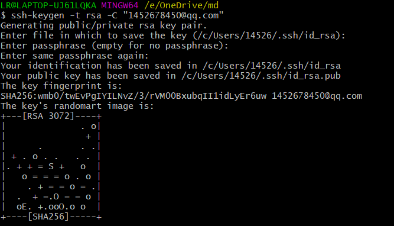
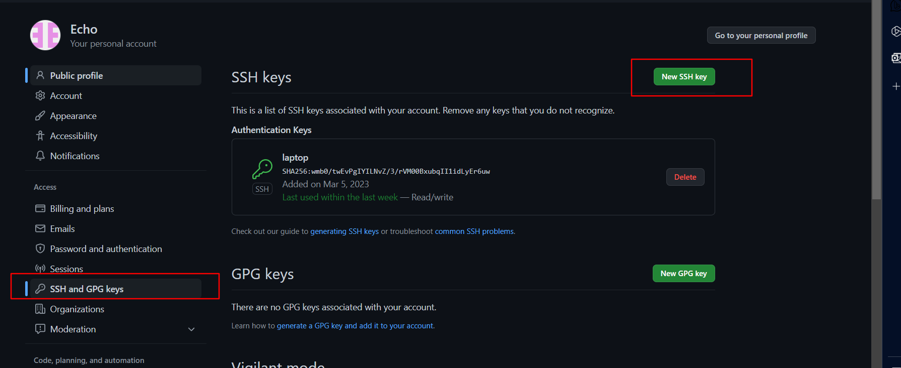
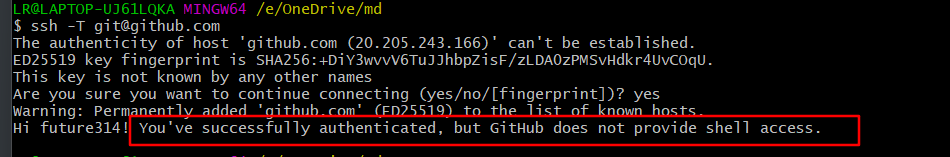
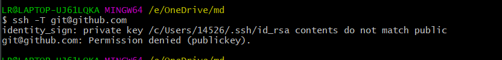
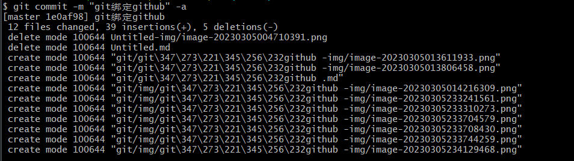

1、git界面输入ssh-keygen -t rsa -C "注册GitHub的邮箱地址"生成密钥

2.密钥生成路径

3.将生成的公钥id_rsa.pub打开并粘贴复制到github

4.使用ssh -T git@github.com 验证本地git是否与GitHub绑定成功

​	如果出现验证未通过，删除本地路径下原来证书（C:\Users\14526\.ssh）再重新生成

5. 设置用户名和登录邮箱

   

6. git init 命令初始化git仓库

   

7. git add .  将所有文件提交到本地仓库

8. 在github上创建仓库

9. git通过git remote add origin 仓库ssh地址 将远程仓库与本地关联

   

10. git commit -m " " [file name] 将暂存区的文件提交到本地库

    

11. git push -f origin master 将本地仓库强制提交到远程库

    origin 代表远程仓库名称，master 为分支。