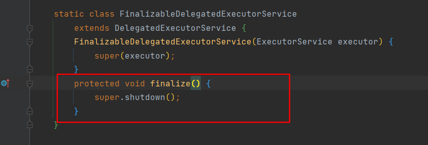

1. 线程池ThreadPoolExecutor局部变量使用，corePoolSize>0时，若未主动关闭线程池，由于核心线程持有线程池引用，GC将无法回收线程池，造成内存泄漏。
newSingleThreadExecutor线程池却不会有这个问题，返回的是一个FinalizableDelegatedExecutorService委托对象，线程池ThreadPoolExecutor对象是作为FinalizableDelegatedExecutorService对象的成员变量。newSingleThreadExecutor内部的工作线程持有的引用是ThreadPoolExecutor对象，所以GC时FinalizableDelegatedExecutorService委托对象可以被正常回收，其次FinalizableDelegatedExecutorService在GC时会调用finalize()方法。
   
   将会关闭线程池，故当线程池任务执行完成后能够被正常回收。