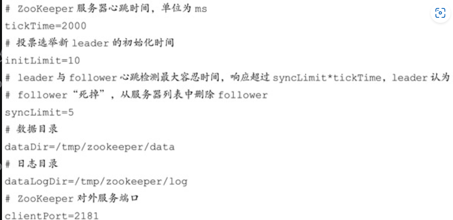
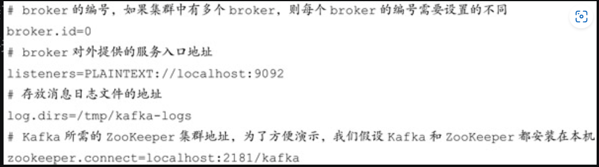
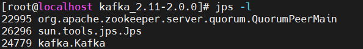
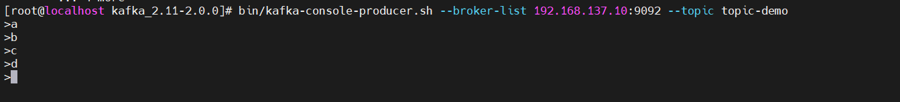
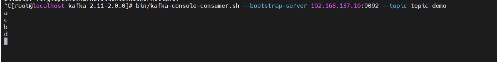

1. 安装jdk

   1. 查看yum中的java1.8包

      yum list java-1.8*

   2. 直接安装java

       yum install java-1.8.0-openjdk* -y

2. 安装配置ZooKeeper

   1. 下载安装包zookeeper-3.4.12.tar.gz到/opt

   2. tar -zxvf zookeeper-3.4.12.tar.gz 解压

   3. cd zookeeper-3.4.12 进入目录

   4. cp zoo_sample.cfg  zoo.cfg 修改conf目录中zoo_sample.cfg文件修改为zoo.cfg

   5. 配置zoo.cfg文件

      

   6. mkdir -p /tmp/zookeeper/data /tmp/zookeeper/log创建目录

   7. 在/tmp/zookeeper/data目录下创建myid文件，并写入一个数值，myid文件里的数字即为服务器编号。

   8. bin/zkServer.sh start 启动zookeeper

   9. bin/zkServer.sh status查看zookeeper服务状态

3. 安装配置Kafka

   1. 下载安装包kafka_2.11-2.0.0.tgz

   2. tar -zxvf kafka_2.11-2.0.0.tgz 解压

   3. 修改配置文件$KAFKA_HOME/conf/server.properties

      

   4. 启动kafak

      直接启动：bin/kafka-server-start.sh config/server.properties

      后台启动：bin/kafka-server-start.sh -daemon config/server.properties

      ​				  nohup bin/kafka-server-start.sh  config/server.properties 1>nohup.log 2>&1  &

   5. jps验证Kafka进程是否启动

      jps -l

      

   6. Kafka 脚本验证生产消费功能是否正常

       bin/kafka-topics.sh --zookeeper localhost:2181/kafka --create --topic topic-demo --replication-factor 1 --partitions 4：

      ​	创建一个分区数为 4、副本因子为 1 的主题topic-demo，其中--zookeeper指定了Kafka所连接的ZooKeeper服务地址，--topic指定了所要创建主题的名称，--replication-factor 指定了副本因子，--partitions 指定了分区个数，--create是创建主题的动作指令

      

      bin/kafka-topics.sh --zookeeper localhost:2181/kafka --describe --topic topic-demo

      ​	通过--describe展示主题的更多具体信息

      ​	

      bin/kafka-console-consumer.sh --bootstrap-server 192.168.137.10:9092 --topic topic-demo：

      ​	订阅主题topic-demo，其中--bootstrap-server指定了连接的Kafka集群地址，--topic指定了消费者订阅的主题

      切换到另一个shell终端，使用bin/kafka-console-producer.sh --broker-list 192.168.137.10:9092 --topic topic-demo：

      ​	发送一条消息至主题topic-demo，其中--broker-list指定了连接的Kafka集群地址，--topic指定了发送消息时的主题

      生产者：

      

      消费者：

      

​	