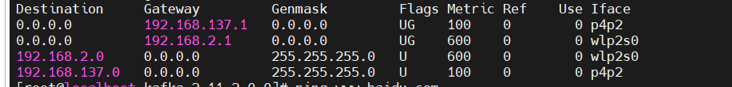
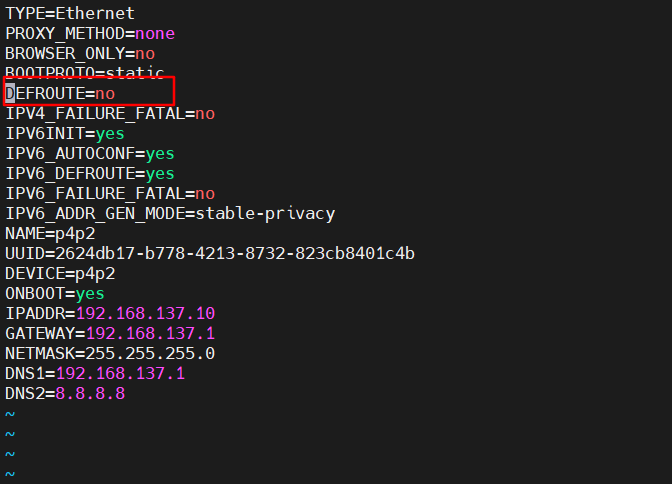

### 连接wifi后无法上网，可以ping 通网关，但是无法ping 百度域名和百度ip

原因：

​	电脑有双网卡，默认路由是指向有线网卡网关ip, 而有线网卡没有连接外网，导致数据包都会转发给有线网卡网关，而没有通过wifi网卡转发。

解决方案：

1、直接删除路由

​	删除有限网卡的默认路由。

​	查看路由：

​	route -n

​	删除路由：

​	route del -net 0.0.0.0 netmask 0.0.0.0 gw 192.168.137.1

这样在重启网络服务后，有线网卡的默认路由又恢复了

2、配置网卡时将有线网卡的默认路由关闭，即DEFROUTE=no

​	

开启无线网卡的默认路由

重启网络后，网络连通。