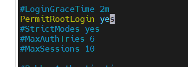
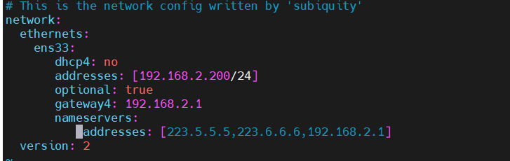
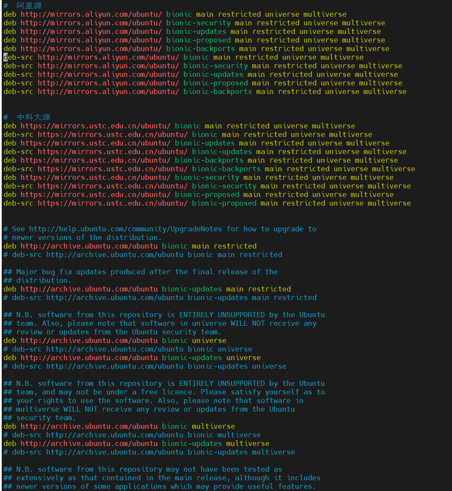
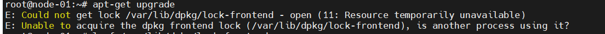
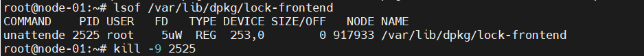
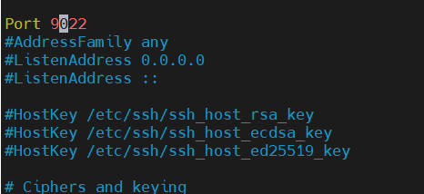

- 开启允许root ssh远程登录  
   1. `vim /etc/ssh/sshd_config`  
        修改PermitRootLogin为yes  
        

   2. 重启网络服务  
        `service sshd restart`

- 设置静态ip  
   1. `vim /etc/netplan/00-installer-config.yaml`  
        修改对应网卡配置  
        ```yaml
            network:
                ethernets:
                    ens33:
                        dhcp4: no
                        addresses: [192.168.2.200/24]
                        optional: true #这个网卡是可选的,开机时配置失败的话就直接跳过
                        gateway4: 192.168.2.1
                        nameservers: #DNS
                            addresses: [223.5.5.5,223.6.6.6,192.168.2.1]
                version: 2
        ```

        

   2. 应用配置  
        `netplan apply`

- 更换国内源
  1. 备份源列表  
    cp /etc/apt/sources.list /etc/apt/sources.list_backup
  2. `vim /etc/apt/sources.list`  
    ```
    #阿里源  
    deb http://mirrors.aliyun.com/ubuntu/ bionic main restricted universe multiverse
    deb http://mirrors.aliyun.com/ubuntu/ bionic-security main restricted universe multiverse
    deb http://mirrors.aliyun.com/ubuntu/ bionic-updates main restricted universe multiverse
    deb http://mirrors.aliyun.com/ubuntu/ bionic-proposed main restricted universe multiverse
    deb http://mirrors.aliyun.com/ubuntu/ bionic-backports main restricted universe multiverse
    deb-src http://mirrors.aliyun.com/ubuntu/ bionic main restricted universe multiverse
    deb-src http://mirrors.aliyun.com/ubuntu/ bionic-security main restricted universe multiverse
    deb-src http://mirrors.aliyun.com/ubuntu/ bionic-updates main restricted universe multiverse
    deb-src http://mirrors.aliyun.com/ubuntu/ bionic-proposed main restricted universe multiverse
    deb-src http://mirrors.aliyun.com/ubuntu/ bionic-backports main restricted universe multiverse


    #中科大源  
    deb https://mirrors.ustc.edu.cn/ubuntu/ bionic main restricted universe multiverse
    deb-src https://mirrors.ustc.edu.cn/ubuntu/ bionic main restricted universe multiverse
    deb https://mirrors.ustc.edu.cn/ubuntu/ bionic-updates main restricted universe multiverse
    deb-src https://mirrors.ustc.edu.cn/ubuntu/ bionic-updates main restricted universe multiverse
    deb https://mirrors.ustc.edu.cn/ubuntu/ bionic-backports main restricted universe multiverse
    deb-src https://mirrors.ustc.edu.cn/ubuntu/ bionic-backports main restricted universe multiverse
    deb https://mirrors.ustc.edu.cn/ubuntu/ bionic-security main restricted universe multiverse
    deb-src https://mirrors.ustc.edu.cn/ubuntu/ bionic-security main restricted universe multiverse
    deb https://mirrors.ustc.edu.cn/ubuntu/ bionic-proposed main restricted universe multiverse
    deb-src https://mirrors.ustc.edu.cn/ubuntu/ bionic-proposed main restricted universe multiverse

    ```

    
    
  3. 更新源  
   `apt-get update`
   

- apt-get 报错
  ```shell
    E: Could not get lock /var/lib/dpkg/lock-frontend - open (11: Resource temporarily unavailable)
    E: Unable to acquire the dpkg frontend lock (/var/lib/dpkg/lock-frontend), is another process using it?
  ```
    

  1. lsof 命令看看这文件是被哪个进程锁住的，然后杀掉进程
    `lsof /var/lib/dpkg/lock-frontend`
    
    


## 修改ssh端口

- `vim /etc/ssh/sshd_config`
- 修改Port
  
- `/etc/init.d/ssh restart` 重启ssh服务

## 使用Fail2ban限制ssh登录失败的ip

- apt install fail2ban
- cp /etc/fail2ban/jail.{conf,local}
- 修改 /etc/fail2ban/jail.local配置文件
- `systemctl restart fail2ban` 重启服务
  