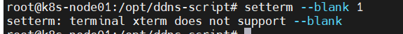
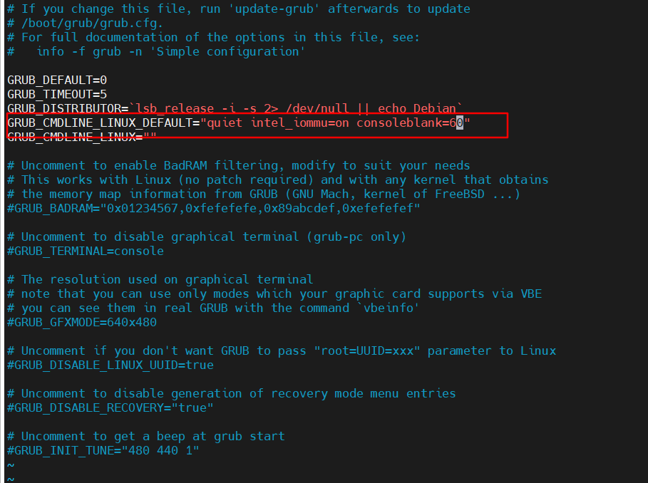

# pve

## 安装pve

  1. 官网下载pve镜像制作成U盘启动盘

  参考：

- <https://soulteary.com/2021/10/23/amd-5800u-notebook-toss-proxmox-ve-7-0-virtualization.html>

## 笔记本安装pve盒盖不休眠、自动息屏

- 盒盖不休眠
    修改/etc/systemd/logind.conf中HandleLidSwitch=ignore
    然后service systemd-logind restart
- 自动息屏
  setterm --blank 1，这个命令只能在笔记本上执行，ssh远程链接后执行会报错
  

  可修改/etc/default/grub文件，在GRUB_CMDLINE_DEFAULT后增加consoleblank=60，然后执行update-grub，以此自动设置自动息屏功能。
  
- 参考：
  <https://stdrc.cc/post/2018/11/07/turn-off-screen-on-linux-server/>
  <https://askubuntu.com/a/1076734>
  